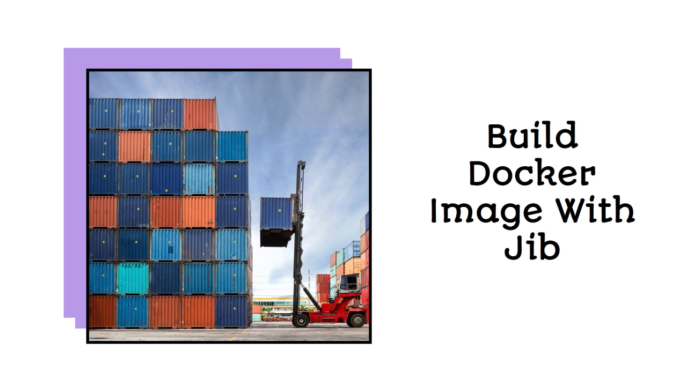

## Overview

This blog post introduces Jib, a powerful tool for building optimized Docker images for Java applications. Jib stands out by eliminating the need for a Docker daemon and expertise in Docker best practices, making it a convenient option for developers. Integrated as a plugin in Gradle or Maven projects, Jib simplifies the process of containerizing Java applications.

<!--truncate-->

## What is Jib?

Jib builds optimized Docker images for your Java applications without a Docker daemon or deep mastery of Docker best practices.
You can use it as a plugin in your Gradle or Maven project.

## Let's configure gradle to use Jib

Jib is used as a plugin, so we need to update the `build.gradle` file. We simply need to add the Jib plugin and define the Jib configuration block.

```gradle title="build.gradle"
plugins {
    . . .
    id 'com.google.cloud.tools.jib' version '3.1.1'
}

. . .

jib {
    from {
        image = "amazoncorretto:11"
    }
    to {
        image = "docker.io/vijaypatidar31/webflux"
        tags = ["latest", version]
    }
    container {
        mainClass = "com.vkpapps.demo.CoolSpringWebfluxApplication"
        jvmFlags = []
        ports = ["443"]
    }
}
```

## Build And Publish Image To Docker Registry

After configuring the jib block, you can run a gradle task to build and publish an image to the Docker registry (gradle jib).

## Benefits

- Using Jib over a traditional Dockerfile for building and packaging Java applications offers several benefits:
- Simplified Configuration: Integrates with Gradle/Maven, eliminating the need for a separate Dockerfile.
- Faster Builds: Uses advanced caching mechanisms, reducing the need to rebuild unchanged layers.
- Reproducible Builds: Ensures builds are reproducible by isolating the build environment from the runtime environment.
- No Docker Daemon Required: Builds Docker images without requiring a Docker daemon, suitable for CI/CD pipelines or restricted environments.
- Automatic Base Image Updates: This can automatically pull the latest base image, ensuring the use of up-to-date images with the latest security patches.
- Layered Image Construction: Automatically separates the application into layers, optimizing the build and pushing process.
- Integration with Container Registries: Seamlessly integrates with popular container registries, making it easy to push images directly from your build tool.
- Advanced Configuration Options: Provides options for customizing the image build, such as specifying entry points, environment variables, JVM flags, and exposed ports.
