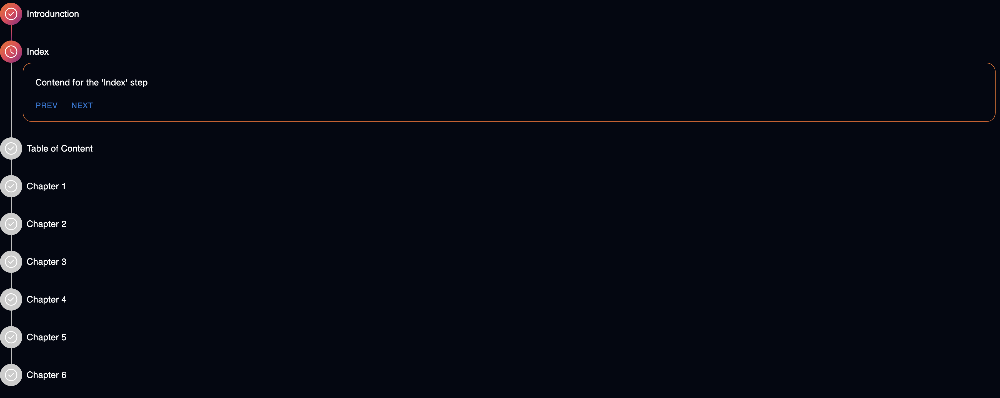

In this post, we’ll walk through how to create a visually appealing **vertical stepper component** in React using [Material UI (MUI)](https://mui.com/) and [Tailwind CSS](https://tailwindcss.com/). This component is fully customizable and comes with gradient connectors, icons, and styled content boxes.

## 

<!-- truncate -->

## 🎯 Goal

We'll build a `VerticleStepper` component that:

- Uses MUI’s `Stepper`, `Step`, and `StepLabel`.
- Has a custom connector and step icon.
- Works with Tailwind for enhanced styling.
- Is reusable and accepts steps and active state as props.

---

## 🧱 Step 1: Build the Component

Create a `VerticleStepper.tsx` file and paste the following code:

```tsx
import React from "react";
import Stepper from "@mui/material/Stepper";
import Step from "@mui/material/Step";
import StepLabel from "@mui/material/StepLabel";
import {
  StepConnector,
  stepConnectorClasses,
  StepContent,
  styled,
  Typography,
  type StepIconProps,
} from "@mui/material";
import { Clock, TickCircle } from "iconsax-reactjs";

export interface VerticleStepperStep {
  label: string;
  content: React.JSX.Element;
}
export interface VerticleStepperProps {
  steps: VerticleStepperStep[];
  activeStep: number;
}

// Custom connector with gradient style
const ColorlibConnector = styled(StepConnector)(({ theme }) => ({
  [`&.${stepConnectorClasses.alternativeLabel}`]: {
    top: 22,
  },
  [`&.${stepConnectorClasses.active}, &.${stepConnectorClasses.completed}`]: {
    [`& .${stepConnectorClasses.line}`]: {
      backgroundImage:
        "linear-gradient( 95deg, rgb(242,113,33) 0%, rgb(233,64,87) 50%, rgb(138,35,135) 100%)",
    },
  },
  [`& .${stepConnectorClasses.line}`]: {
    height: 36,
    border: 0,
    width: 1,
    marginLeft: 8,
    marginTop: -8,
    marginBottom: -8,
    backgroundColor: "#bdbdbd",
    ...theme.applyStyles("dark", {
      backgroundColor: theme.palette.grey[800],
    }),
  },
}));

// Custom step icon
const ColorlibStepIconRoot = styled("div")<{
  ownerState: { completed?: boolean; active?: boolean };
}>(({ theme }) => ({
  backgroundColor: "#ccc",
  zIndex: 1,
  color: "#fff",
  width: 40,
  height: 40,
  display: "flex",
  borderRadius: "50%",
  justifyContent: "center",
  alignItems: "center",
  ...theme.applyStyles("dark", {
    backgroundColor: theme.palette.grey[700],
  }),
  variants: [
    {
      props: ({ ownerState }) => ownerState.active,
      style: {
        backgroundImage:
          "linear-gradient( 136deg, rgb(242,113,33) 0%, rgb(233,64,87) 50%, rgb(138,35,135) 100%)",
        boxShadow: "0 4px 10px 0 rgba(0,0,0,.25)",
      },
    },
    {
      props: ({ ownerState }) => ownerState.completed,
      style: {
        backgroundImage:
          "linear-gradient( 136deg, rgb(242,113,33) 0%, rgb(233,64,87) 50%, rgb(138,35,135) 100%)",
      },
    },
  ],
}));

function ColorlibStepIcon(props: StepIconProps) {
  const { active, completed, className } = props;

  return (
    <ColorlibStepIconRoot
      ownerState={{ completed, active }}
      className={className}
    >
      {active ? <Clock size={25} /> : <TickCircle size={25} />}
    </ColorlibStepIconRoot>
  );
}

// Final component
export const VerticleStepper = ({
  steps,
  activeStep,
}: VerticleStepperProps) => {
  return (
    <Stepper
      activeStep={activeStep}
      orientation="vertical"
      connector={<ColorlibConnector />}
    >
      {steps.map(({ label, content }) => (
        <Step key={label}>
          <StepLabel StepIconComponent={ColorlibStepIcon}>
            <Typography className="text-white">{label}</Typography>
          </StepLabel>
          <StepContent style={{ marginLeft: 20, marginTop: "-8px" }}>
            <div className="border-1 rounded-2xl p-2.5 border-[rgb(242,113,33)] border-r-[rgb(260,119,33)] border-b-[rgb(210,90,33)]">
              {content}
            </div>
          </StepContent>
        </Step>
      ))}
    </Stepper>
  );
};
```

---

## ⚙️ Step 2: Use the Component

You can now import and use the `VerticleStepper` in your main page or any component:

```tsx
import React from "react";
import { VerticleStepper } from "./VerticleStepper";
import { Button } from "@mui/material";

export default function Home() {
  const [active, setActive] = React.useState(0);

  return (
    <VerticleStepper
      activeStep={active}
      steps={[
        "Introduction",
        "Index",
        "Table of Contents",
        "Chapter 1",
        "Chapter 2",
        "Chapter 3",
        "Chapter 4",
        "Chapter 5",
        "Chapter 6",
      ].map((step) => ({
        label: step,
        content: (
          <div>
            <div className="m-3">Content for the &apos;{step}&apos; step</div>
            <div>
              {active !== 0 && (
                <Button onClick={() => setActive((s) => s - 1)}>Prev</Button>
              )}
              {active < 8 && (
                <Button onClick={() => setActive((s) => s + 1)}>Next</Button>
              )}
            </div>
          </div>
        ),
      }))}
    />
  );
}
```
